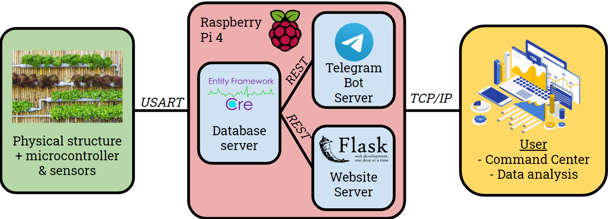
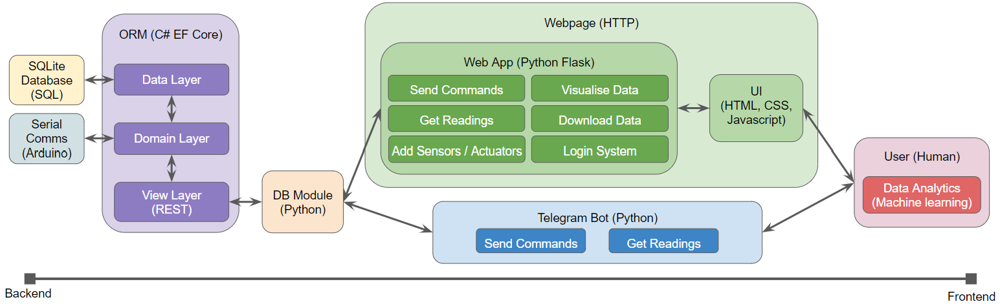

# HydRC4nics

Smart autonmous hydroponic gardening system in collaboration with NUS Residential College 4, RC4SPACE & RC4Earth.

## Motivation

Singapore aims to produce 30% of its nutritional needs by 2030. Land productivity, water, and energy efficiency are believed to be the solution to Singapore's **food security issue**. High technology farms, vertical farming, and hydroponics are some of the solutions that people have produced to tackle the problem.

More on vertical farming: <https://www.youtube.com/watch?v=IBleQycVanU>

**Hydroponics** offers the opportunity to teach us about sustainable agriculture and systems thinking; and allows **optimised plant growth** through greater time, resource, and space efficiency.

## Aim

We hope to construct a vertical hydroponic garden equipped with a smart IoT monitoring and control system. The smart embedded monitoring and control system consists of a microcontroller sensor array along with a microcomputer-based application deployed on the web.

The physical structure and electronics will be developed and built separately as part of a Residential College 4 initiative. In this project, we wish to develop the backend and interface for us to monitor and control the system.

## User Stories

We envision 3 types of users who would use the HydRC4nics system:

- Administrators will have full control over the system and its functionalities. The administrators will be a small core team of RC4 students.

- Operators will only have access to controlling the system through commands (e.g. turning on and off the lights, adding water) and viewing of data (e.g. measuring the nutrient content of the water). The operators will be comprised of RC4 students who have shown interest in learning about the system.

- Viewers will only have access to viewing data from the system. This last group consists of all other interested individuals such as other NUS students or members of the public.

We envision each type of user to use the HydRC4nics system in ways similar to those listed below:


1. As an operator who wants to monitor the lights, water levels and nutrient levels in the system, I want to be able to access the information remotely and conveniently.

2. As an operator who wants to control the system, I want to be able to control the system remotely through an easy to use interface.

3. As an interested individual who is curious about the system, I want to be able to view information and data on the system remotely and submit suggestions quickly and conveniently.

4. As an administrator who wants to prevent abuse of the system, I want to be able to identify abusers, and restrict their access if they continue to cause problems.

## System Overview



## Technologies Used



Telegram Bot

- Python
- Telegram Bot API

Webpage

- Python
- Flask
- HTML, CSS, Javascript
- Bootstrap
- Dash

Database

- C#
- Entity Framework Core
- REST API
- Serial Communication

## Setup

1. Install Python Packages

    ```bash
    pip3 install -r ./Application/requirements.txt
    ```

2. Add environment variables to .bashrc

    ```bash
    export BOT_TOKEN=REPLACE
    export FLASK_SECRET=REPLACE
    export DB_URL=REPLACE
    export JWT_SECRET=REPLACE
    ```

3. Install .NET SDK 3.1

    <https://docs.microsoft.com/en-gb/dotnet/core/install/linux-package-manager-ubuntu-1910>

4. Install EFcore

    ```bash
    dotnet tool install --global dotnet-ef
    ```

5. Create EFcore secret

    ```bash
    touch ./Database/secret.txt
    printf "REPLACE" > ./Database/secret.txt
    ```

6. Database migrations

    ```bash
    cd Database/EFCoreSample
    dotnet ef migrations add InitialCreate
    dotnet ef database update
    cd ../..
    ```

7. Create master user

    ```bash
    touch ./Database/Identity/master.txt
    printf "EMAIL/NAME/PASSWORD" > ./Database/Identity/master.txt
    ```

8. Identity migrations

    ```bash
    cd Database/Identity
    dotnet ef migrations add InitialCreate
    dotnet ef database update
    cd ../..
    ```

## Run (use tmux)

Database

```bash
tmux
cd Database/EFCoreSample
dotnet run
```

Identity

```bash
tmux
cd Database/Identity
dotnet run
```

Telegram Bot

```bash
tmux
python3 Application/bot.py
```

Webpage

```bash
tmux
python3 Application/web.py
```
